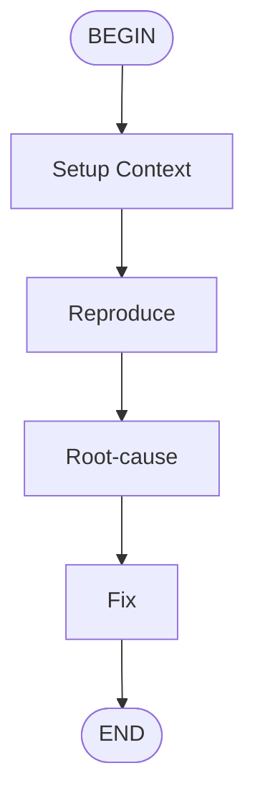

# Bug Investigator Flow

Investigate a bug systematically: understand the issue,
  identify the root cause, and propose a fix.

## Flow

## Parameters

- **bug_report** (required): The bug report or issue description
- **code_context**: Relevant code or error logs

## Steps

1. **reproduce**: Execute reproduce subflow
2. **root-cause**: Execute root-cause subflow
3. **fix**: Execute fix subflow

## Prompt

Investigate the following bug:

  {{ bug_report }}

  Additional code context:
  {{ code_context }}
