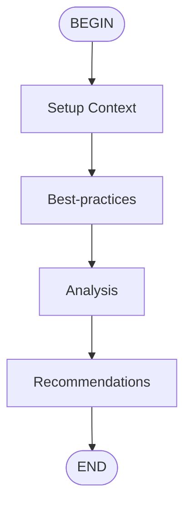

# Code Review Flow

Perform a comprehensive code review by first identifying best practices,
  then analyzing the code, and finally providing actionable recommendations.

## Flow



## Parameters

- **code** (required): The code to review
- **language**: Programming language [default: auto-detect]

## Steps

1. **best-practices**: Execute best-practices subflow
2. **analysis**: Execute analysis subflow
3. **recommendations**: Execute recommendations subflow

## Prompt

Review the following {{ language }} code:

  ```{{ language }}
  {{ code }}
  ```
