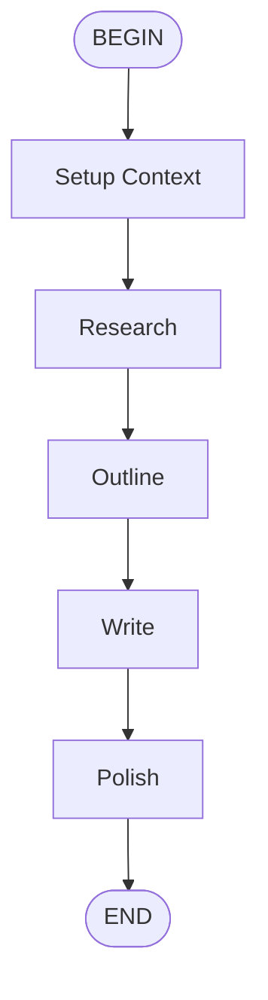

# Content Writer Flow

Create high-quality content through a structured process:
  research, outline, write, and polish.

## Flow

## Parameters

- **topic** (required): The topic to write about
- **content_type**: Type of content to create [default: article]
- **audience**: Target audience [default: general]
- **tone**: Writing tone [default: professional]

## Steps

1. **research**: Execute research subflow
2. **outline**: Execute outline subflow
3. **write**: Execute write subflow
4. **polish**: Execute polish subflow

## Prompt

Create {{ content_type }} content about: {{ topic }}

  Target audience: {{ audience }}
  Tone: {{ tone }}
