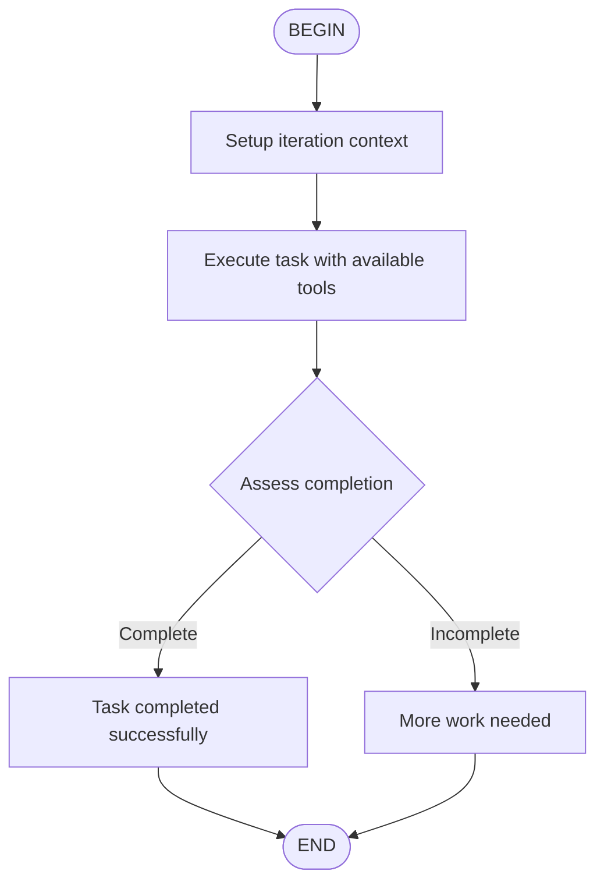

# Default Ralph Iteration

Execute one iteration of a task using available tools, then assess whether the task is complete or needs more work.

## When to Use

This flow is used internally by the Ralph loop mode. Each execution represents one iteration of work on a complex task.

## Flow



## Instructions

1. **Setup**: Review the iteration context (current iteration number, max iterations, accumulated results)

2. **Execute**: Use available tools to make progress on the task:
   - Read files to understand context
   - Write/edit files to implement changes
   - Run commands to verify work
   - Use subagents for specialized tasks

3. **Assess**: After execution, determine if the task is:
   - **Complete**: All objectives achieved, no further work needed
   - **Incomplete**: Partial progress, more iterations required

## Output Format

Always conclude your response with ONE of these choice tags:

**For complete tasks:**
```
<choice>STOP</choice>

Summary: [What was accomplished in this iteration]
Final result: [The completed work]
```

**For incomplete tasks:**
```
<choice>CONTINUE</choice>

Progress this iteration: [What was done]
Remaining work: [What still needs to be done]
Next steps: [Specific actions for next iteration]
```

## Context Variables

When invoked, the following context is available:
- `userRequest`: The original task description
- `iteration`: Current iteration number (0-indexed)
- `maxIterations`: Maximum allowed iterations
- `previousResults`: Accumulated results from prior iterations

## Example

**Input:**
- userRequest: "Implement authentication system"
- iteration: 2
- maxIterations: 5
- previousResults: ["Analyzed requirements", "Created login endpoint"]

**Execution:**
1. Review context: iteration 2/5, need to add JWT validation
2. Execute: Add JWT middleware and token generation
3. Assess: Login works but tests missing → Incomplete

**Output:**
```
<choice>CONTINUE</choice>

Progress this iteration: Added JWT validation middleware and token generation
Remaining work: Need to write unit tests for auth endpoints
Next steps: Create test file with login/logout test cases
```
