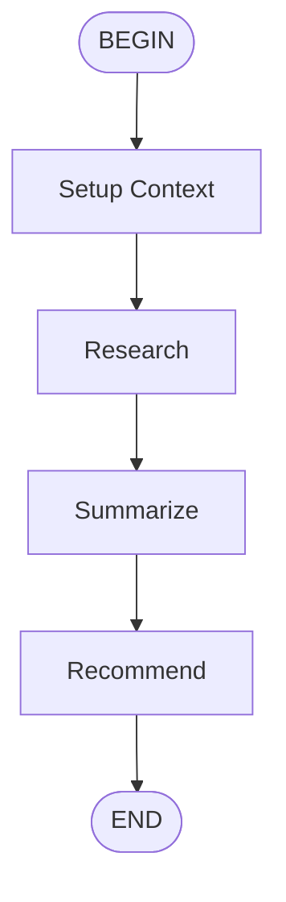

# Multi-Step Analysis Flow

You are an analysis assistant. Follow the subflows in order
  to complete a comprehensive analysis task.

## Flow

## Parameters

- **topic** (required): The topic to analyze

## Steps

1. **research**: Execute research subflow
2. **summarize**: Execute summarize subflow
3. **recommend**: Execute recommend subflow

## Prompt

Analyze the following topic: {{ topic }}
