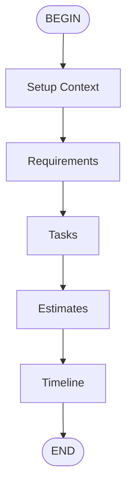

# Project Planner Flow

Create a comprehensive project plan by gathering requirements,
  breaking down tasks, estimating effort, and creating a timeline.

## Flow

## Parameters

- **project_description** (required): Description of the project to plan
- **team_size**: Number of team members [default: 1]
- **target_date**: Target completion date [default: flexible]

## Steps

1. **requirements**: Execute requirements subflow
2. **tasks**: Execute tasks subflow
3. **estimates**: Execute estimates subflow
4. **timeline**: Execute timeline subflow

## Prompt

Create a project plan for:

  {{ project_description }}

  Team size: {{ team_size }}
  Target completion: {{ target_date }}
