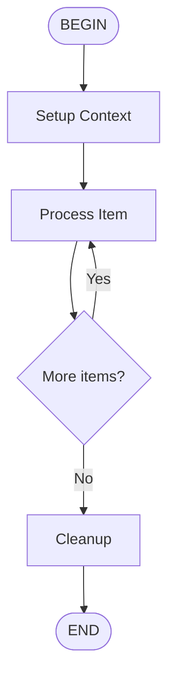

# Test Loop Flow

A test flow to verify loop support in the build-time flow compiler.

## Flow

## Parameters

- **items** (required): List of items to process

## Steps

1. **Setup**: Initialize processing context
2. **Process**: Process each item (loops until done)
3. **Cleanup**: Finalize and return results

## Prompt

Process the following items:
{{ items }}
