# API Route Map

How every route is consumed — by CLI commands, the gateway adapter, or external services.

## Architecture Overview

```mermaid
graph TB
    subgraph External["External Services"]
        GChat["Google Chat<br/>Webhooks"]
        Inngest["Inngest<br/>Daemon"]
        Monitor["Monitoring /<br/>Heartbeat"]
    end

    subgraph CLI["CLI (src/cli/)"]
        GW_CMD["gateway"]
        CH_CMD["channels"]
        MSG_CMD["message"]
        SESS_CMD["sessions"]
        MEM_CMD["memory"]
        CRON_CMD["cron"]
        LOG_CMD["logs"]
        SKILL_CMD["skills"]
        AGENT_CMD["agent"]
        STATUS_CMD["status / doctor"]
    end

    subgraph Client["CLI Client (src/cli/lib/client.ts)"]
        APIFETCH["apiFetch()<br/>raw HTTP"]
    end

    subgraph Server["Mastra Server (:4111)"]
        subgraph Public["Public (no auth)"]
            R_HEALTH["GET /_gateway/health"]
            R_STARTUP["GET /_gateway/startup"]
            R_WEBHOOK["POST /_gateway/webhook/googlechat"]
            R_SKILLSTAT["GET /_skills/status"]
            R_INNGEST["ALL /api/inngest"]
        end

        subgraph GatewayAPI["Gateway API (/_gateway/v1/)"]
            R_CHANNELS["GET /channels"]
            R_CHSTATUS["GET /channels/:type/status"]
            R_MSGSEND["POST /messages/send"]
            R_MEMRESET["POST /memory/reset"]
            R_CRON_LIST["GET /cron/jobs"]
            R_CRON_TRIG["POST /cron/jobs/:name/trigger"]
            R_CRON_RST["POST /cron/jobs/:name/reset"]
            R_CRON_RLD["POST /cron/reload"]
            R_LOG_SSE["GET /logs/stream"]
            R_GW_STOP["POST /gateway/stop"]
            R_GW_RESTART["POST /gateway/restart"]
            R_SKILLS["GET /skills"]
            R_SKILL1["GET /skills/:name"]
        end

        subgraph Custom["/api/ Custom Routes"]
            R_WM["GET /api/memory/working-memory"]
            R_ALERT["POST /api/alerts/heartbeat"]
        end

        subgraph Builtin["Mastra Built-in (/api/)"]
            R_GENERATE["POST /api/agents/:id/generate"]
            R_STREAM["POST /api/agents/:id/stream"]
            R_THREADS["GET /api/memory/threads"]
            R_THREAD1["GET /api/memory/threads/:id"]
            R_THREADMSG["GET /api/memory/threads/:id/messages"]
            R_THREADDEL["DELETE /api/memory/threads/:id"]
            R_LOGS["GET /api/logs"]
            R_LOGTRANS["GET /api/logs/transports"]
        end
    end

    subgraph Adapter["Gateway Adapter (adapter.ts)"]
        ADAPT["GatewayAdapter<br/>raw HTTP"]
    end

    subgraph AlertH["Alert Handler"]
        ALERTH["handleHeartbeatAlert()"]
    end

    %% CLI → Client (all commands use the same HTTP path)
    GW_CMD --> APIFETCH
    CH_CMD --> APIFETCH
    MSG_CMD --> APIFETCH
    SESS_CMD --> APIFETCH
    MEM_CMD --> APIFETCH
    CRON_CMD --> APIFETCH
    LOG_CMD --> APIFETCH
    SKILL_CMD --> APIFETCH
    AGENT_CMD --> APIFETCH
    STATUS_CMD --> APIFETCH

    %% Client → Server
    APIFETCH -->|status,doctor,<br/>memory status| R_HEALTH
    APIFETCH --> R_STARTUP
    APIFETCH --> R_GW_STOP
    APIFETCH --> R_GW_RESTART
    APIFETCH --> R_CHANNELS
    APIFETCH --> R_CHSTATUS
    APIFETCH --> R_MSGSEND
    APIFETCH --> R_MEMRESET
    APIFETCH --> R_CRON_LIST
    APIFETCH --> R_CRON_TRIG
    APIFETCH --> R_CRON_RST
    APIFETCH --> R_CRON_RLD
    APIFETCH --> R_LOG_SSE
    APIFETCH --> R_SKILLS
    APIFETCH --> R_SKILL1
    APIFETCH --> R_WM
    APIFETCH --> R_GENERATE
    APIFETCH --> R_STREAM
    APIFETCH --> R_THREADS
    APIFETCH --> R_THREAD1
    APIFETCH --> R_THREADMSG
    APIFETCH --> R_THREADDEL
    APIFETCH --> R_LOGS
    APIFETCH --> R_LOGTRANS

    %% Adapter → Server
    ADAPT --> R_GENERATE
    ADAPT --> R_THREADS
    ADAPT --> R_THREAD1
    ADAPT --> R_THREADMSG
    ADAPT --> R_THREADDEL
    ADAPT --> R_WM

    %% Alert Handler → Server
    ALERTH --> R_GENERATE
    R_ALERT --> ALERTH

    %% External → Server
    GChat --> R_WEBHOOK
    Inngest --> R_INNGEST
    Monitor --> R_ALERT

    %% Styling
    classDef public fill:#e8f5e9,stroke:#4caf50
    classDef gateway fill:#e3f2fd,stroke:#2196f3
    classDef custom fill:#fff3e0,stroke:#ff9800
    classDef builtin fill:#f3e5f5,stroke:#9c27b0

    class R_HEALTH,R_STARTUP,R_WEBHOOK,R_SKILLSTAT,R_INNGEST public
    class R_CHANNELS,R_CHSTATUS,R_MSGSEND,R_MEMRESET,R_CRON_LIST,R_CRON_TRIG,R_CRON_RST,R_CRON_RLD,R_LOG_SSE,R_GW_STOP,R_GW_RESTART,R_SKILLS,R_SKILL1 gateway
    class R_WM,R_ALERT custom
    class R_GENERATE,R_STREAM,R_THREADS,R_THREAD1,R_THREADMSG,R_THREADDEL,R_LOGS,R_LOGTRANS builtin
```

## Route Detail Table

### Public Routes (no auth)

| Route | Method | Handler | Consumers |
|-------|--------|---------|-----------|
| `/_gateway/health` | GET | `client.ts` | CLI `gateway status`, `doctor`, `status`, `memory status` (resourceId discovery) |
| `/_gateway/startup` | GET | `client.ts` | CLI `gateway start` |
| `/_gateway/webhook/googlechat` | POST | `client.ts` | Google Chat (inbound webhooks) |
| `/_skills/status` | GET | `client.ts` | Public introspection |
| `/api/inngest` | ALL | `client.ts` | Inngest daemon |

### Gateway API (`/_gateway/v1/`) — auth required

| Route | Method | Handler | Consumers |
|-------|--------|---------|-----------|
| `/_gateway/v1/channels` | GET | `client.ts` | CLI `channels list`, `channels status` |
| `/_gateway/v1/channels/:type/status` | GET | `client.ts` | CLI `channels status <type>` |
| `/_gateway/v1/messages/send` | POST | `client.ts` | CLI `message send` |
| `/_gateway/v1/memory/reset` | POST | `client.ts` | CLI `memory reset` |
| `/_gateway/v1/cron/jobs` | GET | `client.ts` | CLI `cron list` |
| `/_gateway/v1/cron/jobs/:name/trigger` | POST | `client.ts` | CLI `cron trigger` |
| `/_gateway/v1/cron/jobs/:name/reset` | POST | `client.ts` | CLI `cron reset` |
| `/_gateway/v1/cron/reload` | POST | `client.ts` | CLI `cron reload` |
| `/_gateway/v1/logs/stream` | GET | `client.ts` | CLI `logs --follow` (SSE) |
| `/_gateway/v1/gateway/stop` | POST | `client.ts` | CLI `gateway stop` |
| `/_gateway/v1/gateway/restart` | POST | `client.ts` | CLI `gateway restart` |
| `/_gateway/v1/skills` | GET | `client.ts` | CLI `skills list` |
| `/_gateway/v1/skills/:name` | GET | `client.ts` | CLI `skills info` |

### Custom `/api/` Routes — auth required

| Route | Method | Handler | Consumers |
|-------|--------|---------|-----------|
| `/api/memory/working-memory` | GET | `client.ts` | CLI `memory status` (composite), Adapter `getWorkingMemory()` |
| `/api/alerts/heartbeat` | POST | `client.ts` | External monitoring systems → `handleHeartbeatAlert()` |

### Mastra Built-in Routes — auth required

| Route | Method | Consumers |
|-------|--------|-----------|
| `POST /api/agents/:id/generate` | POST | Adapter `callAgentViaHttp()`, Alert handler, CLI `agent` |
| `POST /api/agents/:id/stream` | POST | CLI `agent --stream` |
| `GET /api/memory/threads` | GET | Adapter `listThreads()`, CLI `sessions list` |
| `GET /api/memory/threads/:id` | GET | Adapter `getThreadById()`, CLI `sessions show` |
| `GET /api/memory/threads/:id/messages` | GET | Adapter `getThreadMessages()`, CLI `sessions show` |
| `DELETE /api/memory/threads/:id` | DELETE | Adapter `deleteThread()`, CLI `sessions delete` |
| `GET /api/logs` | GET | CLI `logs` batch query |
| `GET /api/logs/transports` | GET | CLI `logs` transport discovery |

## Consumer → Route Matrix

### CLI Commands

| Command | Subcommand | Client Method | Route |
|---------|------------|---------------|-------|
| `gateway` | `start` | `startGateway()` | `GET /_gateway/startup` |
| `gateway` | `stop` | `stopGateway()` | `POST /_gateway/v1/gateway/stop` |
| `gateway` | `restart` | `restartGateway()` | `POST /_gateway/v1/gateway/restart` |
| `gateway` | `status` | `getGatewayStatus()` | `GET /_gateway/health` |
| `channels` | `list` | `listChannels()` | `GET /_gateway/v1/channels` |
| `channels` | `status` | `getChannelStatus()` | `GET /_gateway/v1/channels/:type/status` |
| `message` | `send` | `sendMessage()` | `POST /_gateway/v1/messages/send` |
| `sessions` | `list` | `listThreads()` | `GET /api/memory/threads` |
| `sessions` | `show` | `getThread()` + `getThreadMessages()` | `GET /api/memory/threads/:id` + `/messages` |
| `sessions` | `delete` | `deleteThread()` | `DELETE /api/memory/threads/:id` |
| `memory` | `status` | `getMemoryStatus()` | `GET /_gateway/health` (resourceId) + `GET /api/memory/threads` + `GET /api/memory/working-memory` |
| `memory` | `reset` | `resetMemory()` | `POST /_gateway/v1/memory/reset` |
| `cron` | `list` | `listCronJobs()` | `GET /_gateway/v1/cron/jobs` |
| `cron` | `trigger` | `triggerCronJob()` | `POST /_gateway/v1/cron/jobs/:name/trigger` |
| `cron` | `reset` | `resetCronJob()` | `POST /_gateway/v1/cron/jobs/:name/reset` |
| `cron` | `reload` | `reloadCron()` | `POST /_gateway/v1/cron/reload` |
| `logs` | *(batch)* | `getLogs()` | `GET /api/logs/transports` + `GET /api/logs` |
| `logs` | `--follow` | `streamLogs()` | `GET /_gateway/v1/logs/stream` |
| `skills` | `list` | `listSkills()` | `GET /_gateway/v1/skills` |
| `skills` | `info` | `getSkill()` | `GET /_gateway/v1/skills/:name` |
| `agent` | *(default)* | `generate()` | `POST /api/agents/:id/generate` |
| `agent` | `--stream` | `streamGenerate()` | `POST /api/agents/:id/stream` |
| `status` | | `getGatewayStatus()` | `GET /_gateway/health` |
| `doctor` | | `getGatewayStatus()` | `GET /_gateway/health` |

### Gateway Adapter (`src/mastra/gateway/adapter.ts`)

All calls are raw HTTP with auth header, by design (security boundary).

| Method | Route | Purpose |
|--------|-------|---------|
| `callAgentViaHttp()` | `POST /api/agents/interactiveAgent/generate` | Process inbound messages |
| `listThreads()` | `GET /api/memory/threads?resourceId=` | Find threads for resource |
| `getThreadById()` | `GET /api/memory/threads/:id` | Resolve thread for session |
| `getThreadMessages()` | `GET /api/memory/threads/:id/messages` | Fetch conversation history |
| `deleteThread()` | `DELETE /api/memory/threads/:id` | Delete threads (memory reset) |
| `getWorkingMemory()` | `GET /api/memory/working-memory?resourceId=` | Resource-scoped working memory |

### Alert Handler (`src/mastra/gateway/handlers/alert-handler.ts`)

| Function | Route | Purpose |
|----------|-------|---------|
| `callAgentViaHttp()` | `POST /api/agents/interactiveAgent/generate` | Deliver heartbeat alerts to agent |
