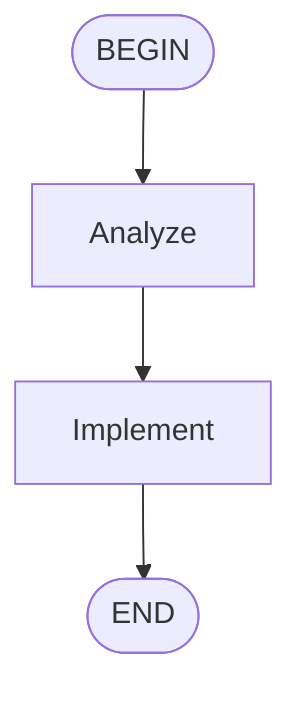
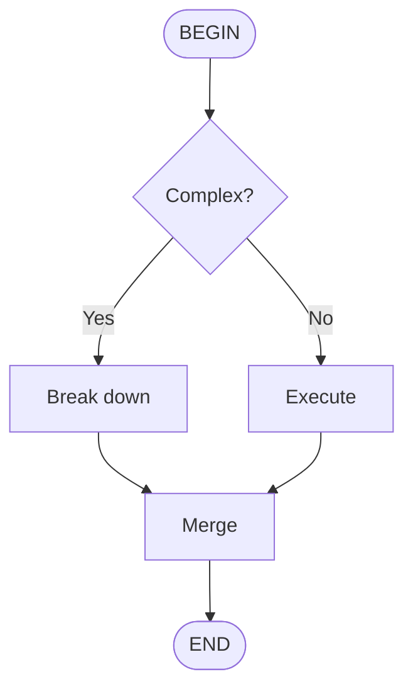
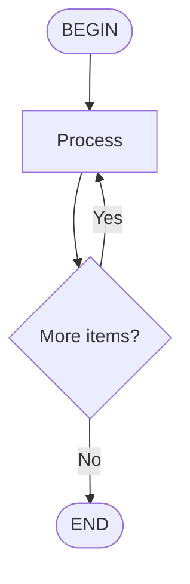
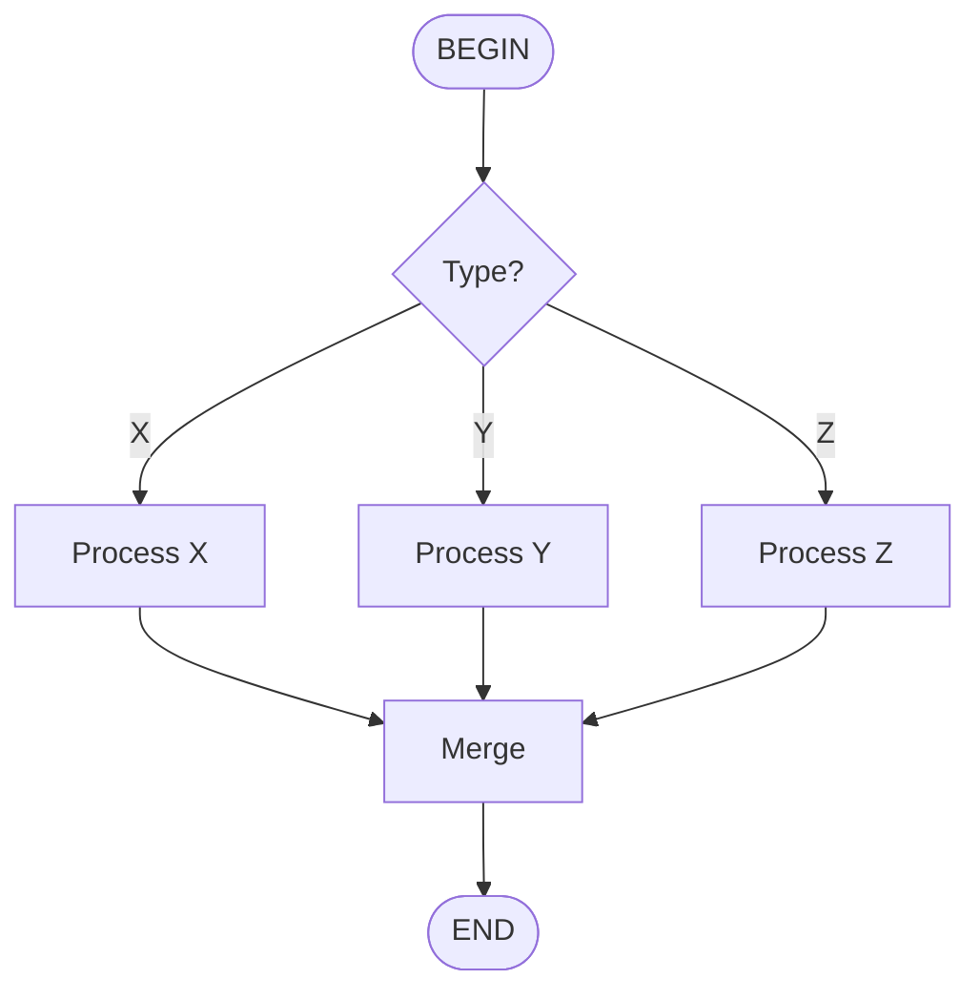

# Dynamic Flow Router

## Overview

The Dynamic Flow Router is a Mastra workflow that executes Kimi flow skills using **runtime graph traversal**, mirroring the internal behavior of Kimi Code CLI's Flow Runner.

### Key Characteristics

| Aspect | Dynamic Flow Router | Native Compile-Time Workflow |
|--------|---------------------|------------------------------|
| **Graph Processing** | Runtime interpretation | Compile-time code generation |
| **Topology Support** | Arbitrary (cycles, merges, any graph) | Tree-like structures |
| **State Management** | State machine with position tracking | Mastra's native step chaining |
| **Observability** | Single workflow step | Granular step-level tracing |
| **Use Case** | Complex flows, Kimi compatibility | Simple flows, Studio debugging |

## Architecture

### Design Philosophy

The Dynamic Flow Router implements a **state machine pattern** identical to Kimi's Flow Runner:

```typescript
// Kimi Flow Runner (Python)
current_id = self._flow.begin_id
while True:
    node = self._flow.nodes[current_id]
    edges = self._flow.outgoing[current_id]
    next_id = await self._execute_node(node, edges)
    current_id = next_id

// Dynamic Flow Router (TypeScript)
let currentNodeId = flowGraph.beginId;
while (true) {
    const node = flowGraph.nodes.find(n => n.id === currentNodeId);
    const edges = flowGraph.edges.filter(e => e.src === currentNodeId);
    const nextNodeId = await executeNode(node, edges);
    currentNodeId = nextNodeId;
}
```

### State Schema

The workflow maintains execution state in Mastra's state management:

```typescript
interface FlowState {
  currentNodeId: string;           // Current position in graph
  executionPath: string[];         // History of visited nodes
  moves: number;                   // Safety counter
  decisions: Array<{               // User decisions recorded
    nodeId: string;
    choice: string;
    timestamp: string;
  }>;
  nodeResults: Record<string, string>;  // Output from each task
  userRequest: string;             // Original user request
  context: Record<string, any>;    // Additional context
  flowGraph: {                     // Serialized graph structure
    nodes: FlowNode[];
    edges: FlowEdge[];
    beginId: string;
    endId: string;
  };
}
```

### Execution Flow

```
┌─────────────────┐
│   Load Skill    │  Parse SKILL.md, extract Mermaid diagram
└────────┬────────┘
         ▼
┌─────────────────┐
│   Parse AST     │  Convert Mermaid to navigable graph
└────────┬────────┘
         ▼
┌─────────────────┐     ┌──────────────┐
│  Initialize     │────▶│ currentNodeId│
│    State        │     │ = beginId    │
└─────────────────┘     └──────────────┘
         │
         ▼
┌─────────────────┐
│   while (true)  │◄─────────────────────────────┐
└────────┬────────┘                              │
         ▼                                       │
┌─────────────────┐     ┌─────────┐    ┌────────┴────────┐
│  Get Current    │────▶│  BEGIN  │───▶│ Transition to   │
│     Node        │     │  (skip) │    │ next node       │
└────────┬────────┘     └─────────┘    └─────────────────┘
         │
         ▼
┌─────────────────┐     ┌─────────┐    ┌─────────────────┐
│   Check Type    │────▶│   END   │───▶│ Return success  │
└────────┬────────┘     └─────────┘    └─────────────────┘
         │
         ▼
┌─────────────────┐     ┌─────────┐    ┌─────────────────┐
│   Check Type    │────▶│ DECISION│───▶│ Suspend for     │
└────────┬────────┘     │         │    │ user choice     │
         │              └─────────┘    └─────────────────┘
         │                                    │
         │                                    ▼
         │                           ┌─────────────────┐
         │                           │ Resume with     │
         │                           │ choice → match  │──────┐
         │                           │ edge → continue │      │
         │                           └─────────────────┘      │
         │                                                    │
         ▼                                                    │
┌─────────────────┐                                           │
│  TASK: Execute  │                                           │
│  with taskAgent │───────────────────────────────────────────┘
└────────┬────────┘
         ▼
┌─────────────────┐
│ Store result,   │
│ transition to   │
│ next node       │
└─────────────────┘
```

## Comparison with Kimi Flow Runner

### Similarities

| Feature | Kimi Flow Runner | Dynamic Flow Router |
|---------|------------------|---------------------|
| Graph Storage | `self._flow` (Flow object) | `flowGraph` in state |
| Position Tracking | `current_id` | `currentNodeId` |
| Execution Loop | `while True` | `while (true)` |
| Move Limiting | `max_moves` check | `MAX_MOVES` constant |
| Decision Handling | Parse `<choice>`, match edge | Parse `resumeData.choice`, match edge |
| Node Types | `begin`, `end`, `task`, `decision` | Same + validation |
| State Persistence | Checkpoint system | Mastra state + suspend/resume |

### Differences

| Aspect | Kimi Flow Runner | Dynamic Flow Router |
|--------|------------------|---------------------|
| Language | Python | TypeScript |
| Framework | Custom (kosong/soul) | Mastra |
| Subprocess | Spawns CLI tools | Calls Mastra agents |
| State Storage | Internal checkpointing | Mastra's state management |
| Error Handling | Try/catch with logging | Structured error classes |
| Observability | Console output | Mastra Studio tracing |

## Usage

### Basic Execution

```typescript
import { dynamicFlowRouterWorkflow } from './workflows/dynamic-flow-router';

// Create run
const run = await dynamicFlowRouterWorkflow.createRun();

// Start execution
const result = await run.start({
  inputData: {
    flowName: 'code-review',
    userRequest: 'Review the authentication module',
  },
});

// Handle result
switch (result.status) {
  case 'completed':
    console.log('Result:', result.result);
    console.log('Path:', result.executionPath);
    break;
  case 'suspended':
    console.log('Waiting for user choice...');
    console.log('Options:', result.options);
    break;
  case 'error':
    console.error('Failed:', result.error);
    break;
}
```

### Via Interactive Agent

When registered with the interactive agent, the workflow is automatically exposed as a tool:

```typescript
// Agent configuration
export const interactiveAgent = new Agent({
  id: "interactive-agent",
  // ... other config
  workflows: {
    nativeFlowExecutionWorkflow,  // Compile-time
    dynamicFlowRouterWorkflow,     // Runtime (NEW)
  },
});
```

The agent can then invoke:

```
User: "Execute the code-review flow for the auth system"
Agent: [Calls dynamicFlow tool with flowName="code-review"]
```

### Resume After Suspension

```typescript
// Initial execution
const run = await dynamicFlowRouterWorkflow.createRun();
const result = await run.start({
  inputData: {
    flowName: 'code-review',
    userRequest: 'Review the auth module',
  },
});

if (result.status === 'suspended') {
  // User makes choice
  const userChoice = 'Yes'; // From UI/CLI
  
  // Resume
  const resumed = await run.resume({
    resumeData: { choice: userChoice },
  });
  
  console.log('Resumed result:', resumed);
}
```

### With Explicit Skill Path

```typescript
const result = await run.start({
  inputData: {
    flowName: 'custom-flow',
    userRequest: 'Do something',
    skillPath: '/path/to/custom/skills', // Override discovery
    workingDir: '/home/user/project',     // Custom workspace
  },
});
```

## Error Handling

### Error Types

```typescript
// Base error class
class FlowRouterError extends Error {
  code: string;
  details?: Record<string, unknown>;
}

// Specific error types
class FlowNotFoundError extends FlowRouterError {
  // Flow skill file not found
}

class FlowParseError extends FlowRouterError {
  // Invalid Mermaid or SKILL.md
}

class FlowExecutionError extends FlowRouterError {
  // Task execution failed
  nodeId: string;
  nodeLabel: string;
}

class MaxMovesExceededError extends FlowRouterError {
  // Safety limit exceeded
  maxMoves: number;
  executionPath: string[];
}
```

### Error Recovery

The workflow includes retry configuration:

```typescript
const dynamicFlowRouterWorkflow = createWorkflow({
  // Retry entire workflow on failure
  retryConfig: {
    attempts: 3,
    delay: 1000,
  },
})
  .then(flowRouterStep)  // Step also has retries: 3
  .commit();
```

### Error Monitoring

Lifecycle callbacks enable external monitoring:

```typescript
createWorkflow({
  options: {
    onError: async (errorInfo) => {
      // Send to error tracking
      await sentry.captureException(errorInfo.error, {
        extra: {
          runId: errorInfo.runId,
          workflowId: errorInfo.workflowId,
          state: errorInfo.state,
        },
      });
      
      // Send alert
      await pagerDuty.alert({
        severity: 'critical',
        message: `Flow execution failed: ${errorInfo.error?.message}`,
      });
    },
    
    onFinish: async (result) => {
      // Record metrics
      await datadog.increment('workflow.completed', 1, {
        status: result.status,
        workflowId: result.workflowId,
      });
    },
  },
});
```

## Supported Flow Patterns

### Linear Flow



✅ Both workflows support this perfectly.

### Branching (Decisions)



✅ Dynamic router handles via suspend/resume.

### Loops (Cycles)



✅ Dynamic router handles naturally (updates `currentNodeId`).

⚠️ Compile-time workflow requires `.dowhile()` translation.

### Complex Merge



✅ Dynamic router handles any merge pattern.

⚠️ Compile-time workflow struggles with complex merges.

## Configuration

### Workflow Options

```typescript
export const dynamicFlowRouterWorkflow = createWorkflow({
  id: 'dynamicFlow',
  name: 'Dynamic Flow Router',
  description: '...',
  
  // Schemas
  inputSchema,
  outputSchema,
  stateSchema,
  
  // Retry configuration
  retryConfig: {
    attempts: 3,      // Max retry attempts
    delay: 1000,      // Delay between retries (ms)
  },
  
  // Lifecycle callbacks
  options: {
    onFinish: async (result) => {
      // Called on completion (success/failure/suspend)
    },
    onError: async (errorInfo) => {
      // Called only on failure
    },
  },
});
```

### Step Options

```typescript
const flowRouterStep = createStep({
  id: 'flow-router',
  description: '...',
  
  // Schemas
  inputSchema,
  outputSchema,
  stateSchema,
  suspendSchema,  // For decision suspension
  resumeSchema,   // For decision resumption
  
  // Step-level retry
  retries: 3,
  
  // Execution
  execute: async ({ inputData, state, setState, suspend, resumeData, mastra }) => {
    // Implementation
  },
});
```

## Testing

### Unit Test Example

```typescript
import { describe, it, expect } from 'vitest';
import { dynamicFlowRouterWorkflow } from './dynamic-flow-router';

describe('Dynamic Flow Router', () => {
  it('should execute a simple linear flow', async () => {
    const run = await dynamicFlowRouterWorkflow.createRun();
    
    const result = await run.start({
      inputData: {
        flowName: 'test-linear',
        userRequest: 'Test request',
      },
    });
    
    expect(result.status).toBe('completed');
    expect(result.executionPath).toContain('BEGIN');
    expect(result.executionPath).toContain('END');
  });
  
  it('should suspend at decision nodes', async () => {
    const run = await dynamicFlowRouterWorkflow.createRun();
    
    const result = await run.start({
      inputData: {
        flowName: 'test-decision',
        userRequest: 'Test request',
      },
    });
    
    expect(result.status).toBe('suspended');
    expect(result.metadata?.decisionQuestion).toBeDefined();
  });
  
  it('should resume from suspension', async () => {
    const run = await dynamicFlowRouterWorkflow.createRun();
    
    // Start
    const suspended = await run.start({
      inputData: {
        flowName: 'test-decision',
        userRequest: 'Test request',
      },
    });
    
    expect(suspended.status).toBe('suspended');
    
    // Resume
    const resumed = await run.resume({
      resumeData: { choice: 'Yes' },
    });
    
    expect(resumed.status).toBe('completed');
  });
});
```

## Migration Guide

### From Kimi CLI

```bash
# Before: Execute via Kimi CLI
kimi /flow:code-review "Review auth module"

# After: Execute via Mastra
const result = await dynamicFlowRouterWorkflow.createRun().start({
  inputData: {
    flowName: 'code-review',
    userRequest: 'Review auth module',
  },
});
```

### From Native Compile-Time

When to migrate:

| Scenario | Recommendation |
|----------|----------------|
| Complex cycles/loops | ✅ Migrate to dynamic |
| Complex merge points | ✅ Migrate to dynamic |
| Need Kimi-exact behavior | ✅ Migrate to dynamic |
| Simple linear flows | Keep compile-time |
| Need Studio step debugging | Keep compile-time |
| Production with observability | Keep compile-time |

## Troubleshooting

### "Flow skill not found"

```
Error: Flow skill "my-flow" not found in workspace
```

**Solutions:**
1. Verify skill exists at `skills/my-flow/SKILL.md`
2. Check working directory is correct
3. Provide explicit `skillPath` parameter

### "Task agent not available"

```
Error: Task agent not available - required for task execution
```

**Solution:** Ensure `taskAgent` is registered in Mastra:

```typescript
export const mastra = new Mastra({
  agents: {
    taskAgent,  // Required for flow execution
    interactiveAgent,
  },
});
```

### "Max moves exceeded"

```
Error: Flow execution exceeded maximum moves (1000)
```

**Causes:**
- Infinite loop in flow graph
- Missing END node
- Cycle without exit condition

**Solution:** Review Mermaid diagram for infinite loops.

### Invalid choice on resume

```
Error: Invalid choice "Maybe". Available: Yes, No
```

**Cause:** User provided choice that doesn't match edge labels.

**Solution:** Validate user input against available options before resuming.

## Best Practices

1. **Use compile-time for simple flows** - Better Studio visibility
2. **Use dynamic for complex flows** - Handles any topology
3. **Always handle suspended status** - Prompt user for choice
4. **Validate skill files** - Check Mermaid syntax before deployment
5. **Monitor with callbacks** - Integrate onError/onFinish with monitoring
6. **Set appropriate timeouts** - Long flows may need extended timeouts

## Future Enhancements

Potential improvements:

- [ ] Sub-flow invocation (call other flows as nodes)
- [ ] Parallel node execution (fork/join patterns)
- [ ] Dynamic flow modification (add/remove nodes at runtime)
- [ ] Persistence for long-running flows (save/resume across sessions)
- [ ] Visual flow debugger (step through execution)
- [ ] Flow analytics (execution time per node, decision patterns)

## References

- [Kimi Flow Runner Source](https://github.com/MoonshotAI/kimi-cli/blob/main/src/kimi_cli/soul/kimisoul.py)
- [Mastra Workflows Documentation](https://mastra.ai/docs/workflows/overview)
- [Mastra Error Handling](https://mastra.ai/docs/workflows/error-handling)
- [Mastra Suspend & Resume](https://mastra.ai/docs/workflows/suspend-and-resume)
