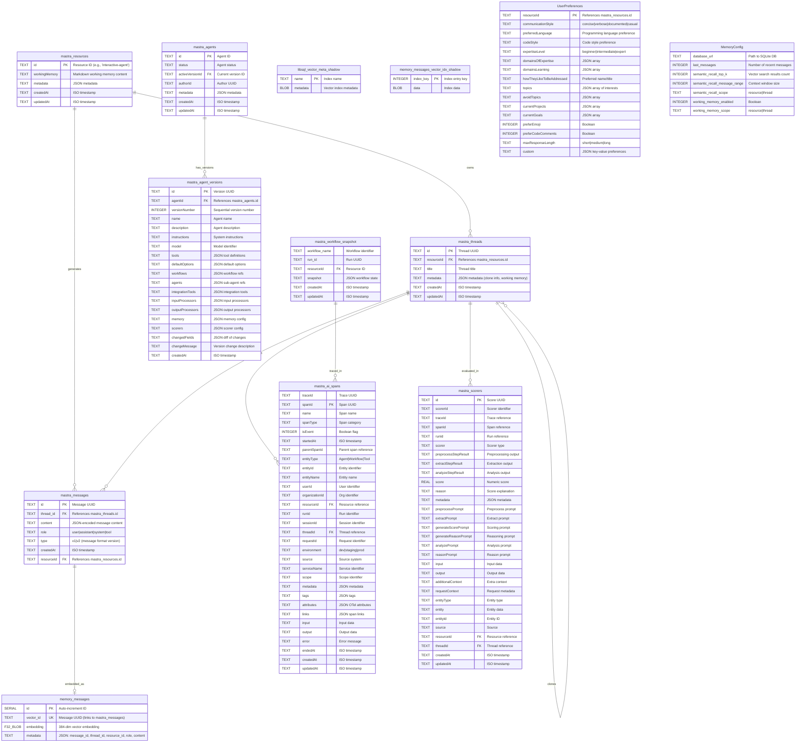

# Mastra Memory Schema ERD

This document provides a comprehensive Entity Relationship Diagram of the Mastra memory system as configured in this project.

## Overview

The memory system consists of three layers:
1. **Core Memory Tables** - Message history, threads, and working memory
2. **Vector Memory Tables** - Semantic search embeddings
3. **Observability Tables** - Tracing and evaluation data
4. **Application Layer** - User preferences schema

---

## Entity Relationship Diagram



---

## Table Descriptions

### Core Memory Tables

#### `mastra_resources`
Stores resource-scoped data. A resource is typically a user or entity that owns conversations.

| Field | Type | Description |
|-------|------|-------------|
| `id` | TEXT (PK) | Resource identifier (e.g., 'interactive-agent') |
| `workingMemory` | TEXT | Markdown content for resource-scoped working memory |
| `metadata` | TEXT | JSON metadata blob |
| `createdAt` | TEXT | ISO 8601 timestamp |
| `updatedAt` | TEXT | ISO 8601 timestamp |

#### `mastra_threads`
Represents conversation threads belonging to a resource.

| Field | Type | Description |
|-------|------|-------------|
| `id` | TEXT (PK) | Thread UUID |
| `resourceId` | TEXT (FK) | Owner resource reference |
| `title` | TEXT | Thread title (auto-generated or custom) |
| `metadata` | TEXT | JSON metadata including clone info and thread-scoped working memory |
| `createdAt` | TEXT | ISO timestamp |
| `updatedAt` | TEXT | ISO timestamp |

#### `mastra_messages`
Individual messages within a thread.

| Field | Type | Description |
|-------|------|-------------|
| `id` | TEXT (PK) | Message UUID |
| `thread_id` | TEXT (FK) | Parent thread reference |
| `content` | TEXT | JSON-encoded message (format depends on `type`) |
| `role` | TEXT | user, assistant, system, or tool |
| `type` | TEXT | v1 or v2 (message format version) |
| `createdAt` | TEXT | ISO timestamp |
| `resourceId` | TEXT (FK) | Resource reference |

### Vector Memory Tables

#### `memory_messages`
Vector embeddings for semantic search. Uses libSQL vector extension.

| Field | Type | Description |
|-------|------|-------------|
| `id` | SERIAL | Auto-increment primary key |
| `vector_id` | TEXT (UK) | Links to mastra_messages.id |
| `embedding` | F32_BLOB(384) | 384-dimensional float vector |
| `metadata` | TEXT | JSON with message context |

---

## Relationships

```
┌─────────────────────────────────────────────────────────────────┐
│                        RESOURCE SCOPE                            │
│  ┌─────────────────┐                                            │
│  │ mastra_resources│◄──────────────────────────────────┐        │
│  │  (User/Entity)  │                                   │        │
│  └────────┬────────┘                                   │        │
│           │ 1:N                                        │        │
│           ▼                                            │        │
│  ┌─────────────────┐     ┌──────────────────┐         │        │
│  │ mastra_threads  │◄────┤  Thread Clones   │         │        │
│  │ (Conversations) │ 1:N └──────────────────┘         │        │
│  └────────┬────────┘                                   │        │
│           │ 1:N                                        │        │
│           ▼                                            │        │
│  ┌─────────────────┐     ┌──────────────────┐          │        │
│  │ mastra_messages │◄────┤ memory_messages  │          │        │
│  │   (Messages)    │ 1:1 │ (Vector Search)  │          │        │
│  └─────────────────┘     └──────────────────┘          │        │
│                                                        │        │
│  WORKING MEMORY:                                       │        │
│  • Resource-scoped: mastra_resources.workingMemory     │        │
│  • Thread-scoped:   mastra_threads.metadata.workingMemory       │
└─────────────────────────────────────────────────────────────────┘
```

---

## Memory Types Summary

| Memory Type | Storage Location | Scope | Use Case |
|-------------|-----------------|-------|----------|
| **Message History** | `mastra_messages` | Thread | Recent conversation context |
| **Working Memory** | `mastra_resources.workingMemory` | Resource | Persistent user profile data |
| **Semantic Recall** | `memory_messages` | Resource/Thread | Vector search across conversations |
| **Thread Metadata** | `mastra_threads.metadata` | Thread | Clone info, custom data |

---

## Configuration Mapping

The `agent.toml` `[memory]` section maps to the database schema:

```toml
[memory]
database_url = "data/local.db"                     → SQLite file path (relative to .agent/)
last_messages = 10                                 → Query limit for mastra_messages
semantic_recall_top_k = 3                          → LIMIT for vector search
semantic_recall_message_range = 2                  → Context messages around hits
semantic_recall_scope = "resource"                 → Search across resource's threads
working_memory_enabled = true                      → Enable working memory
working_memory_scope = "thread"                    → Store in thread metadata
```

---

## User Preferences Schema

Application-specific user preferences (stored via `user-preferences.ts`):

```typescript
interface UserPreferences {
  // Communication
  communicationStyle?: 'concise' | 'verbose' | 'documented' | 'casual'
  preferredLanguage?: string
  codeStyle?: string
  
  // Expertise calibration
  expertiseLevel?: 'beginner' | 'intermediate' | 'expert'
  domainsOfExpertise?: string[]
  domainsLearning?: string[]
  
  // Personalization
  howTheyLikeToBeAddressed?: string
  topics?: string[]
  avoidTopics?: string[]
  currentProjects?: string[]
  currentGoals?: string[]
  
  // Response style
  preferEmoji?: boolean
  preferCodeComments?: boolean
  maxResponseLength?: 'short' | 'medium' | 'long'
  
  // Custom key-values
  custom?: Record<string, string>
}
```

---

*Generated from Mastra memory documentation and live database schema.*
