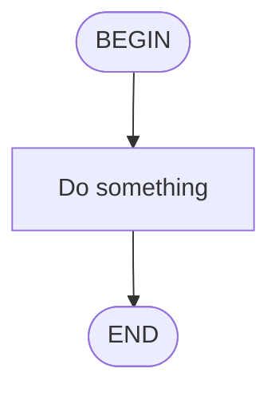
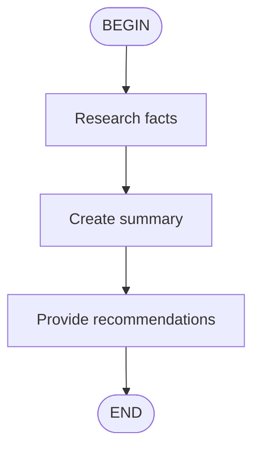

# Unified Skill Specification v2.0

## Overview

This document defines the unified skill format for the agent system. It consolidates all previous skill and flow formats into a single, consistent specification.

## Skill Format (SKILL.md)

All skills are defined in a single markdown file named `SKILL.md` with YAML frontmatter:

```yaml
---
name: skill-name                    # Required: kebab-case identifier
version: "1.0.0"                    # Optional: semver, defaults to 1.0.0
description: "What this skill does" # Required: max 1024 chars
type: standard | flow               # Optional: defaults to standard
author: "Name"                      # Optional
tags: [tag1, tag2]                  # Optional: for categorization
---
```

### Frontmatter Fields

| Field | Required | Type | Description |
|-------|----------|------|-------------|
| `name` | Yes | string | Kebab-case identifier (lowercase, hyphens, numbers). Max 64 chars. |
| `version` | No | string | Semver format (e.g., "1.0.0"). Defaults to "1.0.0". |
| `description` | Yes | string | Human-readable description. Max 1024 chars. |
| `type` | No | enum | Either `standard` or `flow`. Defaults to `standard`. |
| `author` | No | string | Skill author name. |
| `tags` | No | string[] | Array of tags for categorization. |

### Name Format

- Must start with a lowercase letter
- Can contain lowercase letters, numbers, and hyphens
- Must end with a letter or number
- No consecutive hyphens
- Maximum 64 characters

Valid examples: `code-review`, `k8s-ops`, `a`
Invalid examples: `CodeReview`, `code--review`, `-review`, `review-`

## Skill Types

### type: standard

Standard prompt template skills. The markdown content is injected as context when the skill is invoked.

**Best for:**
- Coding standards and guidelines
- Best practices documentation
- Reference materials
- Context augmentation

**Example:**
```markdown
---
name: code-review-standards
description: Best practices for conducting thorough code reviews
---

# Code Review Standards

## Review Checklist

### 1. Correctness
- [ ] Does the code do what it's supposed to do?
- [ ] Are edge cases handled?
```

### type: flow

Flow-orchestration skills with visual diagrams. These define multi-step agent workflows.

**Best for:**
- Multi-step tasks
- Decision-based workflows
- Suspend/resume workflows
- Complex agent orchestration

**Requirements:**
- Must contain a Mermaid or D2 flowchart diagram
- Must have BEGIN and END nodes
- Decision nodes must have labeled edges

**Example:**
```markdown
---
name: multi-step
description: Sequential analysis through research, summarize, and recommend
type: flow
---

# Multi-Step Analysis

Performs comprehensive analysis through three sequential steps.

## Flow


## Execution

1. **Research**: Gather key facts about the topic
2. **Summarize**: Create concise summary under 100 words
3. **Recommend**: Provide 2-3 actionable recommendations

## Output Format

Always conclude with the appropriate choice tag:
```
<choice>STOP</choice>
```
```

## Discovery Locations

Skills are discovered from the following locations in priority order:

### 1. Project Skills (Highest Priority)
- Path: `./.agent/skills/`
- Each subdirectory containing `SKILL.md` is a skill
- Project skills override user and legacy skills with the same name

### 2. User Skills
- Path: `~/.agent/skills/`
- User-level skills shared across projects

### 3. Legacy Locations (Deprecated)
- `./.kimi/skills/`
- `./.claude/skills/`
- `./.codex/skills/`
- `./skills/` (project root)
- `~/.kimi/skills/`
- `~/.claude/skills/`
- `~/.codex/skills/`
- `~/.config/agents/skills/`
- `~/.agents/skills/`

**Note:** Skills from legacy locations will load with a deprecation warning.

## Diagram Formats

### Mermaid

Flow-type skills can include Mermaid flowcharts:



**Node Types:**
- `BEGIN([BEGIN])` - Start node (required, exactly one)
- `END([END])` - End node (required, exactly one)
- `TASK[Label]` - Task node
- `DECISION{Label}` - Decision node (requires labeled outgoing edges)

**Edge Labels:**
Decision nodes must have labeled edges:
```mermaid
DECISION -->|Yes| TASK1
DECISION -->|No| TASK2
```

### D2

Alternative diagram format (less common):

```d2
direction: down

BEGIN: {
  shape: circle
  style.fill: "#90EE90"
  label: |md
    **BEGIN**
  |
}

END: {
  shape: circle
  style.fill: "#FFB6C1"
  label: |md
    **END**
  |
}
```

## Migration from Legacy Formats

### From YAML Flows

Legacy YAML flows in `flows/*.yaml` should be migrated:

| YAML Field | SKILL.md Equivalent |
|------------|---------------------|
| `title` | `name` (converted to kebab-case) |
| `description` | `description` |
| `instructions` | Markdown H1 heading |
| `prompt` | Section in markdown body |
| `parameters` | Section in markdown body |
| `subflows` | Mermaid diagram + execution section |

### Example Migration

**Before (flows/multi-step.yaml):**
```yaml
version: "1.0"
title: Multi-Step Analysis Flow
description: A flow that demonstrates sequential subflow execution

instructions: |
  You are an analysis assistant...

prompt: |
  Analyze the following topic: {{ topic }}

parameters:
  - key: topic
    input_type: string
    requirement: required

subflows:
  - name: research
    path: ./subflows/research.yaml
```

**After (.agent/skills/multi-step/SKILL.md):**
```markdown
---
name: multi-step
description: Sequential analysis through research, summarize, and recommend
type: flow
---

# Multi-Step Analysis

You are an analysis assistant. Follow the steps to complete a comprehensive analysis task.

## Flow



## Parameters

- **topic** (required): The topic to analyze

## Execution

1. **Research**: Research "{{ topic }}" and gather key facts
2. **Summarize**: Create a concise summary under 100 words
3. **Recommend**: Provide 2-3 actionable recommendations
```

## API Reference

### Loading Skills

```typescript
import { loadSkills, discoverSkills } from '@mastra/skills';

// Load all skills from all locations
const { skills, diagnostics } = loadSkills();

// Load from specific location only
const { skills } = loadSkills({ 
  paths: ['./custom/skills/'] 
});

// Discover without loading content
const skillPaths = discoverSkills('./.agent/skills/');
```

### Skill Object

```typescript
interface UnifiedSkill {
  name: string;
  version: string;
  description: string;
  type: 'standard' | 'flow';
  content: string;           // Markdown body (no frontmatter)
  metadata: {
    author?: string;
    tags?: string[];
    // ... other frontmatter fields
  };
  source: {
    filePath: string;        // Absolute path to SKILL.md
    location: 'project' | 'user' | 'legacy';
    originalPath?: string;   // If migrated
  };
  // For type: 'flow' only
  flow?: {
    diagram: string;         // Raw diagram source
    diagramType: 'mermaid' | 'd2';
    nodes: FlowNode[];       // Parsed nodes
    edges: FlowEdge[];       // Parsed edges
  };
}
```

## Validation

Skills are validated at load time:

1. **Frontmatter validation**
   - Required fields present
   - Name format correct
   - Version is valid semver
   - Description not too long

2. **Flow validation** (for type: flow)
   - Exactly one BEGIN node
   - Exactly one END node
   - All decision nodes have labeled edges
   - END is reachable from BEGIN
   - No duplicate edge labels from same node

3. **Content validation**
   - Valid markdown structure
   - No duplicate skill names (across locations)

## Deprecation Timeline

| Phase | Version | Action |
|-------|---------|--------|
| 1 | v2.0 | Unified loader released, legacy loaders emit warnings |
| 2 | v2.1 | Auto-migration tool for YAML flows |
| 3 | v2.5 | Legacy loaders deprecated (still functional) |
| 4 | v3.0 | Legacy loaders removed |

## Related Documents

- `docs/SKILL_AUTHORING.md` - Guide for writing skills
- `docs/FLOW_MIGRATION.md` - Detailed migration guide
- `docs/SKILL_API.md` - Programmatic API reference
